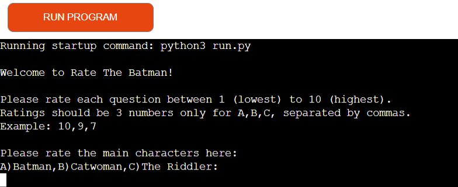
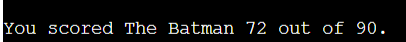
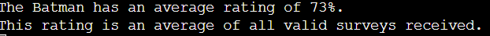
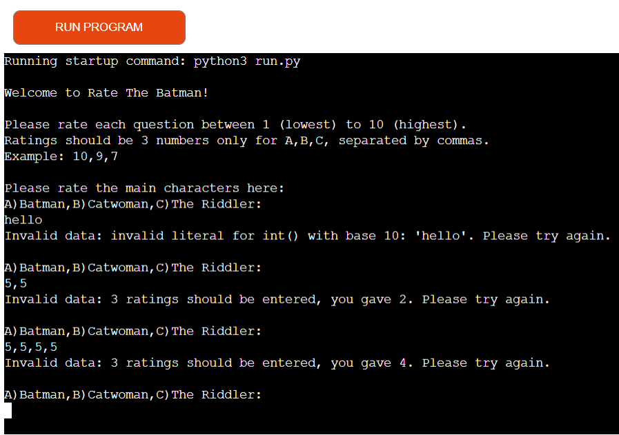
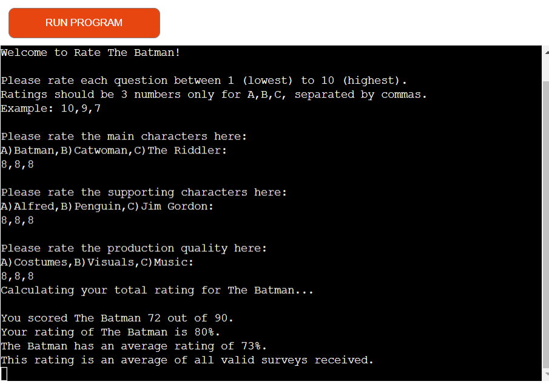
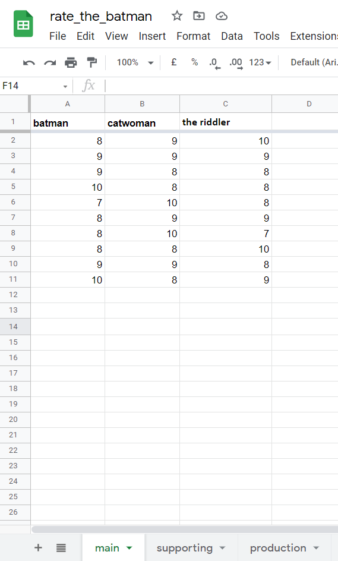
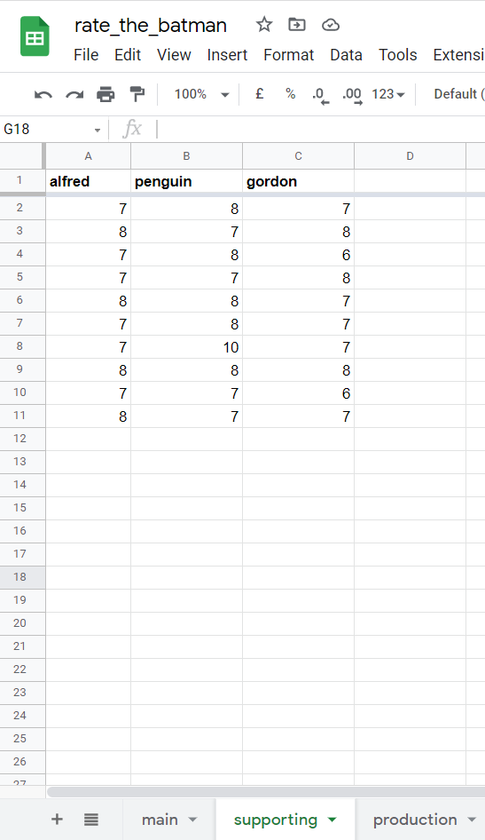
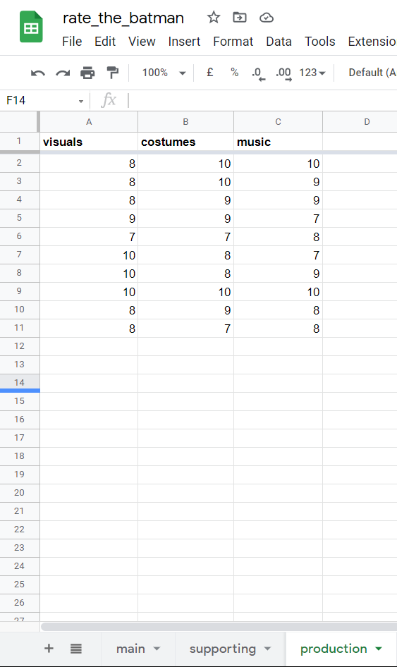

# Rate The Batman

[Live Webpage](https://rate-the-batman.herokuapp.com/)

[rate_the_batman Google Sheet](https://docs.google.com/spreadsheets/d/1azKXLCj6tX55RtOfXPEx_gYg3LoZbx-21pN5ugrU2wc/edit#gid=419322650)

## Table of Contents

1. [Introduction](#introduction)
    1. [Background](#background)
2. [Objectives](#objectives)
    1. [Site Visitors](#site-visitors)
    2. [Site Owners](#site-owners)
3. [User Stories](#user-stories)
4. [Features](#feautures)
    1. [Existing Feautures](#existing-features)
    2. [Future Features](#future-features)
5. [Testing](#testing)
    1. [Python Validator](#python-validator)
    2. [Browsers](#browsers)
    3. [Devices](#devices)
    4. [Terminals](#terminals)
6. [Bugs](#bugs)
    1. [Unfixed Bugs](#unfixed-bugs)
7. [Deployment](#deployment)
8. [Technology Used](#technology-used)
9. [Credits](#credits)
    1. [Content](#content)
10. [Final Thoughts](#final-thoughts)

## Introduction

### Background
Rate The Batman is a simple survey website built using the Python programming language.

Users provide their ratings in the terminal. These ratings are recorded on a dedicated Google Sheet and from here the following are calculated and returned to the user's terminal:
- User's score of The Batman
- User's percentage rating of the Batman
- The average percentage rating of previous survey users.

As The Batman is a movie currently in cinemas at the time of this survey's creation, it was topical to use The Batman as the theme of the survey.

The purpose of the website is to have people who have seen "The Batman" provide their ratings. Users will rate the performances of three of the main characters (Batman, Catwoman, and The Riddler), three of the supporting characters (Alfred, The Penguin, and Jim Gordon), and three of the production values (Visuals, Costume Design, and Music) between 1 and 10.

For the characters, the nature of what the users are rating is left deliberately ambigious and subjective to the user. The user is not told if they are to rate the actor's/actress's performance, or the portrayal of a character, or whether they enjoyed a character or not. They are simply asked to rate the character identified by the character's name. This is to remove any biases the user may have towards an actor or actress.

For the production values, it is assumed that the higher the rating, the greater the enjoyment or quality.

## Objectives

### Site Vistors

The objectives of site visitors are:
- Having seen the The Batman, can I provide feedback?
- Can I provide feedback anonymously?
- Will I be able to rate the characters?
- Will I get to see the rating I give The Batman?

### Site Owners

The objectives of the site owners are:
- To get feedback from the audience.
- To make the survey short and easy to use.
- To gather the publics ratings of specific characters.
- To gather the publics ratings of the production quality.
- To calculate a users score they give The Batman.
- To calculate the average rating of existing and new users who have rated The Batman 

## User Stories

### First Time Users

1. As a first time user, I want to provide feedback on The Batman.
2. As a first time user, I want to know what calculated rating I gave The Batman.
3. As a first time user, I want to know what percentage rating I gave The Batman
4. As a first time user, I want to know what the average rating of The Batman is.
5. As a first time user, I want to know if the data I entered is correct.

### Site Owners

6. As a site owner, I want to gather feedback about The Batman.
7. As a site owner, I want to make the survey short and easy to use.
8. As a site owner, I want to collect and view ratings about specific characters.
9. As a site owner, I want to collect and view ratings about the production quality.
10. As a site owner, I want to know what an individual rating of The Batman is.
11. As a site owner, I want to know what the average rating of The Batman is.

## Feautures

### Existing Features

### Feedback
- Survey allows for user to give feedback on The Batman.
- User stories satisfied: Number 1, 6

### Ratings Calculation
- Once survey is finished successfully by the user, the user's rating is displayed to the terminal
- User stories satisfied: Number 2, 10

### User Percentage Rating
- Once survey is finished successfully by the user, the user's percentage rating is displayed to the terminal.
- User stories satisfied: Number 3, 10

### Average Rating
- Once survery is finished successfully by the user, the overall average percentage rating by all individuals surveyed is displayed to the terminal.
- User stories satisfied: 4, 11

### Valid Data
- If the user enters invalid data as an answer, they are alerted to the terminal and prompted to try again.
- The nature of the error message is displayed.
- Errors occur if:
   - Letters or words are entered by the user.
   - Less than 3 numbers is entered.
   - More than 3 numbers is entered.
- User stories satisfied: Number 5

### Survey Length

- In order to attract and encourage users to complete the survey, the survey is short and simple use with easy directions and example answers provided.
- User stories satisfied: 7

### Data Collection
- All ratings entered by user are recorded to corresponding Google Sheets:
- "main" for main characters ratings

- "supporting" for supporting characters ratings

- "production" for production quality ratings

- All sheets are given 10 rows of dummy survey ratings to simulate previous users and allow average ratings to be calculated better.
- User stories satisfied: Number 8, 9

### Future Features
As the scope of this project only allowed for 24 rows in the terminal, features were limited.
Future features could include:
- Optionally recording the user's name and email address to a new worksheet on Google Sheets and for potentially entering in prize draw for free cinema tickets or similar.

## Testing

### Python Validator

The Python of the website was passed through the [PEP8 Online Checker](http://pep8online.com/).The page returned no errors.

PEP Online Checker Results

### Browsers

The survey webpage was tested on the following browsers:
- Google Chrome
- Internet Explorer

### Devices

The survey website was tested ont the following devices:
- Lenovo Z50
- One Plus 7 mobile phone

### Terminals

- Tested on local Gitpod Terminal.
- Tested on Code Institute's Heroku Terminal.

## Unfixed Bugs
- Terminal accepts negative numbers (e.g. -1) as valid data
- Terminal accepts positive numbers larger than 10 as valid data.

## Deployment

This project was deployed using Code Institute's custom built mock terminal for Heroku.

Steps were:
1. Type "pip2 freeze > requirements.txt" in Gitpod terminal.
2. Git commit and push the changes to requirements.txt file to Github
3. Create a new Heroku app and once created go to Settings Tab first.
4. Scroll down and click "Reveal Config Vars".
5. In the field for KEY type "CREDS" and then copy from workspace on Gitpod the entire creds.JSON file and paste into VALUE field on Heroku settings and click Add.
6. Scroll down and click "Add Buildpack" and choose Python. Add another buildpack called Node.JS and save both in that order.
7. Add another Config Vars. The key is PORT and the value is 8000.
8. Scroll up to the Deploy Tab.
9. Choose Github as Deployment Method and confirm.
10. Search for your repository by its name on and click Connect.
11. Scroll down and choose Deploy manually clicking Deploy Branch.
12. Wait for "Your app was succesfully deployed" message and click View.

## Technlogy Used

- Github
- Gitpod
- Git
- Google Chrome
- Google Cloud Platform
- Google Drive
- Google Sheets
- Snipping Tool
- Heroku
- Internet Explorer

## Credits

### Content

- [Love Sandwiches](https://learn.codeinstitute.net/courses/course-v1:CodeInstitute+LS101+2021_T1/courseware/293ee9d8ff3542d3b877137ed81b9a5b/58d3e90f9a2043908c62f31e51c15deb/) where credited in the run.py file by the [Code Institute](https://codeinstitute.net/ie/)
- How do I add together integers in a list in Python? by [Stack Overflow](https://stackoverflow.com/questions/13909052/how-do-i-add-together-integers-in-a-list-in-python)
- Converting all strings inlist to integers by [GeeksforGeeks](https://www.geeksforgeeks.org/python-converting-all-strings-in-list-to-integers/)

## Final Thoughts

I found this project to be difficult but enjoyable. From my experience doing this project, I did find myself understanding Python the more I wrote the code. Definitely a case of practice make perfect.

I suppose after creating a survey about The Batman, I better actually go and see it! Then I could genuinely complete my own survey!

As always, I'd like to thank my supportive and loving family, girlfriend, and friends.